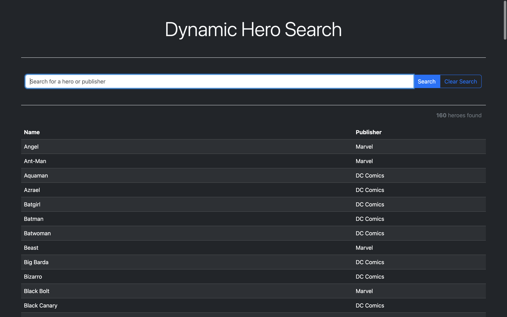

# Dynamic Hero Search

## Table of Contents
- [Overview](#overview)
- [Demo](#demo)
- [Features](#features)
- [Installation](#installation)
- [Usage](#usage)
- [Contributing](#contributing)
- [Acknowledgments](#acknowledgments)
- [License](#license)
- [Author](#author)

## Overview
Explore the superhero universe with Dynamic Hero Search, a project that allows you to effortlessly search and discover your favourite heroes from both DC Comics and Marvel. The interactive search functionality provides a quick and seamless way to find heroes, providing an immersive experience into the world of iconic characters.

## Demo
Check out the live demo on CodePen: [Dynamic Hero Search Demo](https://codepen.io/karlhorning/pen/dyrMzWy)

## Features
- Search and discover superheroes from DC Comics and Marvel.
- Interactive search functionality for a user-friendly experience.

## Installation
Clone the repository from GitHub: [Dynamic Hero Search GitHub Repo](https://github.com/Karl-Horning/dynamic-hero-search)

## Usage
1. Open `index.html` in your preferred web browser.
2. Use the search box to find your favourite superheroes.

## Contributing
Contributions are welcome! Feel free to open issues and pull requests.

## Acknowledgments
- [Bootstrap](https://getbootstrap.com) - Front-end framework for developing responsive and mobile-first websites.
- Special thanks to [CodePen](https://codepen.io) for providing a platform to showcase and share web development projects.

## License
This project is licensed under the [MIT License](LICENSE).

## Author
**Karl Horning:**
- [GitHub](https://github.com/Karl-Horning/)
- [LinkedIn](https://www.linkedin.com/in/karl-horning/)
- [CodePen](https://codepen.io/karlhorning)
